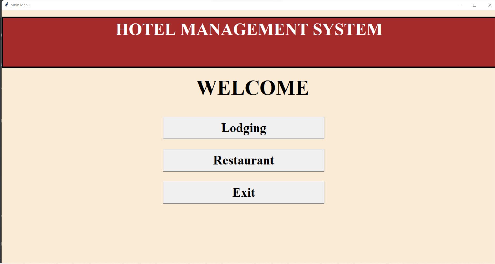
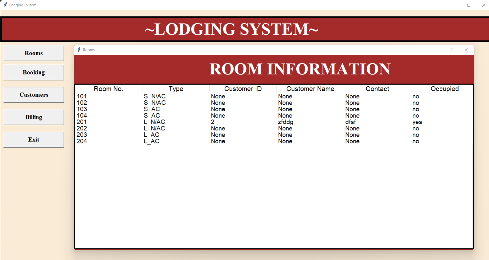
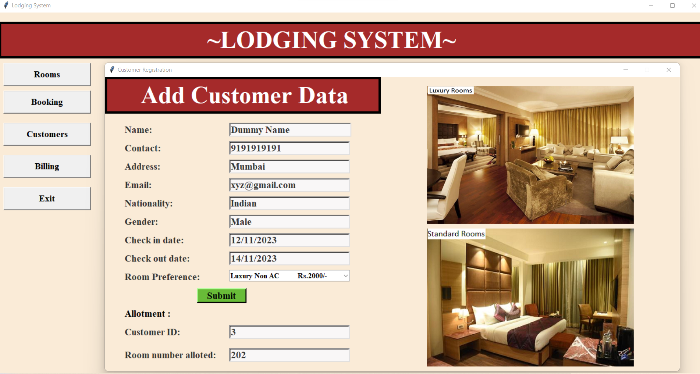
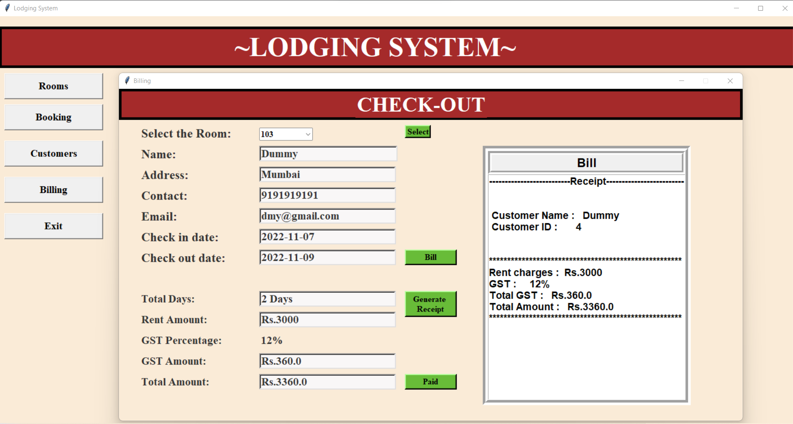
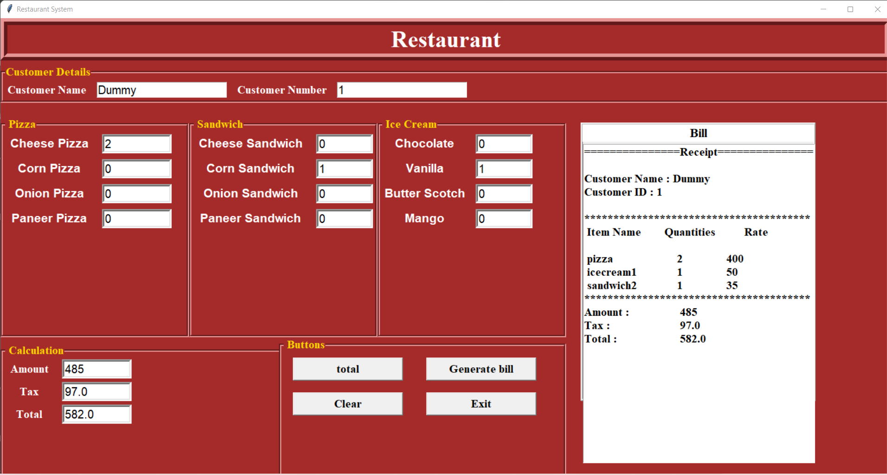

# **🏨 Hotel Management System**

🚀 A desktop application developed using **Python Tkinter** and **SQLite3** designed to efficiently manage hotel operations, including lodging and restaurant billing.

## 📌 Features

- **Lodging System 🏠**:  
  - Manage **Standard** and **Luxury** room details.  
  - Add customer details with room preferences.  
  - Efficient **Check-in** and **Check-out** process.  
  - Automatic **Bill Generation** for lodging services.  

- **Restaurant Billing System 🍽️**:  
  - Select ordered items from the menu.  
  - Automatic calculation of the **total bill**.  
  - Generate detailed bills for customer orders.  

---

## 📸 Screenshots  

| **Home Screen** |
|:----------------:|
|  |

| **Room Management** |
|:---------------------:|
|  |

| **Add Customer Details** |
|:------------------------:|
|  |

| **Checkout Bill Generation** |
|:----------------------------:|
|  |

| **Restaurant Billing System** |
|:-----------------------------:|
|  |
